# XREFS0 Car Rental

A complete desktop management system for car rental businesses. Built with C# WinForms in a strict 3-tier architecture with an embedded SQLite database, it covers the full operational cycle: customers, fleet, bookings, vehicle returns, payments, and maintenance - with no database server installation required.

Repository: https://github.com/XREFS0/XREFS0-Car-Rental

## Features

**Dashboard**

- Live business overview: fleet availability, customer count, active bookings, and total revenue
- One-click access cards for every module, each with its own accent color and hover feedback
- Active user display with role badge, live clock, and status bar

**Customer Management**

- Full customer profiles with contact info, driver license number, and photo
- Instant search and filtering, add / edit / delete with validation

**Fleet (Vehicle) Management**

- Vehicles classified by make, model, year, category, and fuel type
- Automatic availability tracking, mileage and daily-rate management
- Detailed vehicle view with photo

**Bookings**

- Smart booking flow restricted to available vehicles only
- Automatic rental-days and total-due calculation from daily rates
- Pickup / drop-off locations and check notes

**Returns**

- Odometer tracking with automatic consumed-mileage calculation
- Delay and additional-charge handling, fleet status restored on check-in

**Transactions**

- Complete payment ledger: paid vs. actual amounts with automatic remaining / refund computation
- Payment method tracking per return

**Maintenance**

- Maintenance tickets with cost tracking; vehicles under maintenance are locked from rental
- Completion moves records to a permanent maintenance history archive

## Tech Stack

| Layer | Technology |
|---|---|
| UI | C# Windows Forms, .NET Framework 4.7.2 |
| Business logic | Class library (`XREFS0Business`) |
| Data access | ADO.NET with `System.Data.SQLite` (`XREFS0Data`) |
| Database | SQLite (single-file, serverless, `Database/XREFS0CarRental.db`) |
| Build | Visual Studio 2022 or .NET SDK 8 (`dotnet build`) |

## Architecture

The solution enforces a clean 3-tier separation:

| Project | Responsibility |
|---|---|
| `XREFS0CarRental` | WinForms presentation: forms, validation prompts, GDI+ custom painting |
| `XREFS0Business` | Business rules and coordination (availability checks, totals, modes) |
| `XREFS0Data` | All database access, fully parameterized queries, no business logic |
| `Database/XREFS0CarRental.db` | Relational store: 13 tables plus the `vw_ActiveBookings` view |

The UI never touches the database directly. Every query runs through the data-access layer, and every write passes business-rule validation first.

## Database

The database is a single SQLite file that ships with the project, so the application runs immediately after build:

- `Database/XREFS0CarRental.db` - ready-to-run database with lookup data and an `admin` account
- `Database/sqlite-schema.sql` - full schema: tables, indexes, foreign keys, generated columns, views
- `Database/sqlite-seed-data.sql` - complete seed data (customers, fleet, bookings, returns, transactions, catalogs)

Tables include `Users`, `Makes`, `Models`, `FuelTypes`, `VehicleCategories`, `Years`, `Car_Details`, `Customer`, `Vehicles`, `RentalBooking`, `VehicleReturns`, `RentalTransaction` (with computed remaining / refund amounts), `VehicleMaintenance`, and `VehicleMaintenanceHistory`.

To rebuild the database from scratch with any SQLite client:

```bash
sqlite3 XREFS0CarRental.db < Database/sqlite-schema.sql
sqlite3 XREFS0CarRental.db < Database/sqlite-seed-data.sql
```

## Screenshots

### Authentication

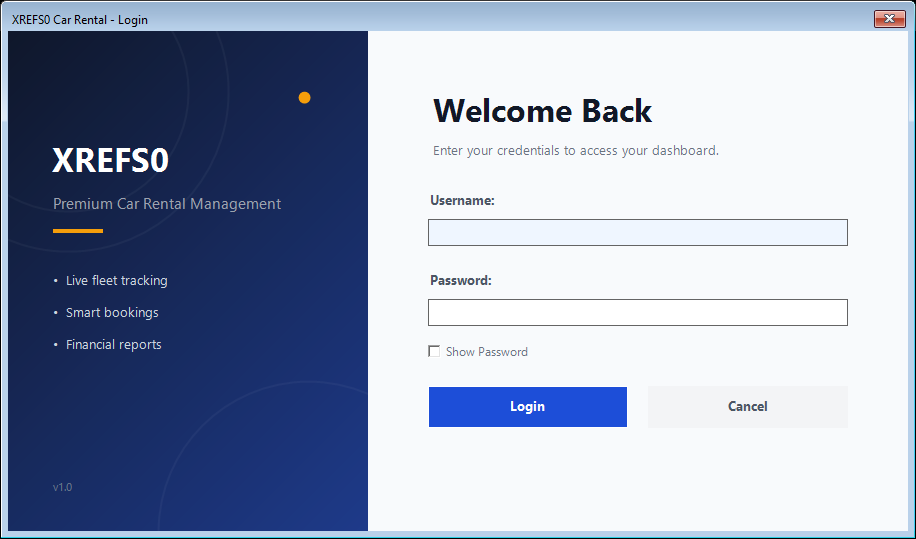


### Dashboard

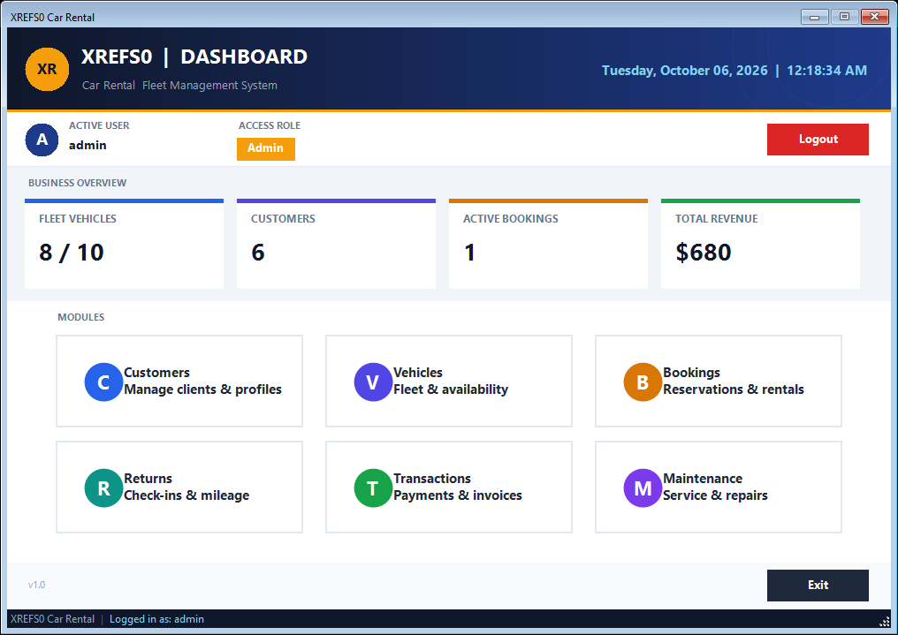

### Customers

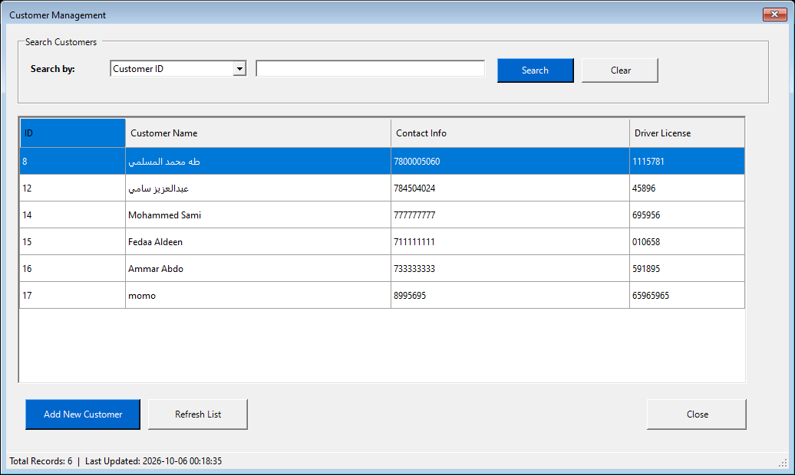

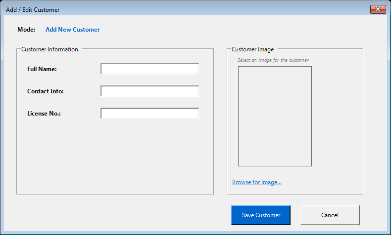

### Fleet

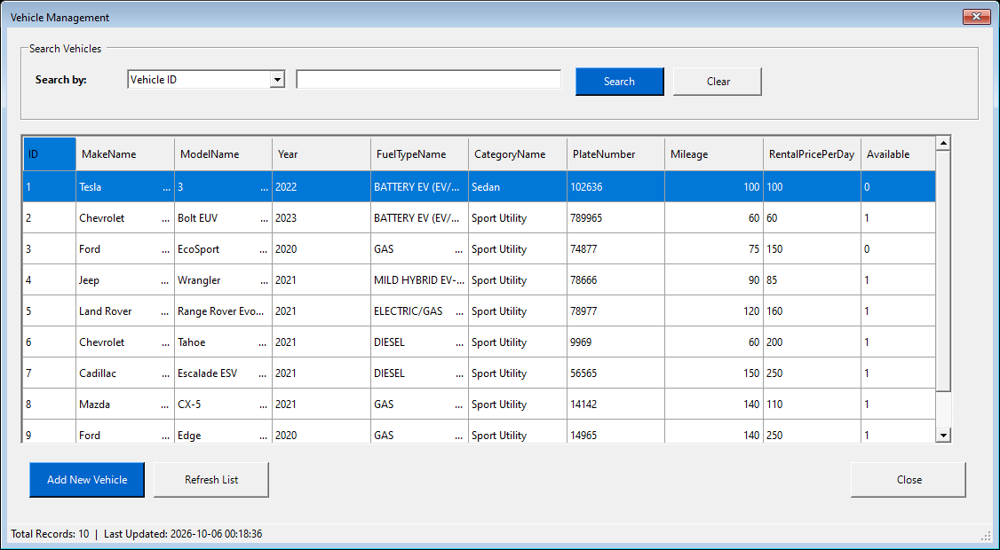

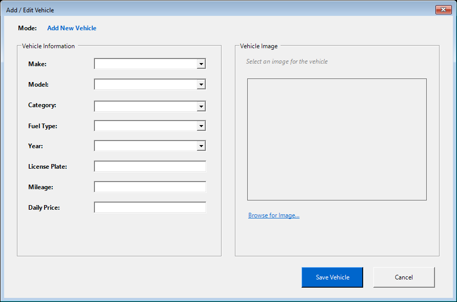

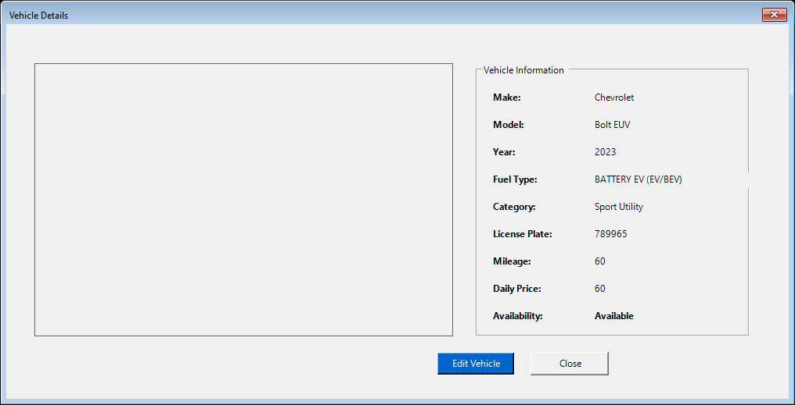

### Bookings

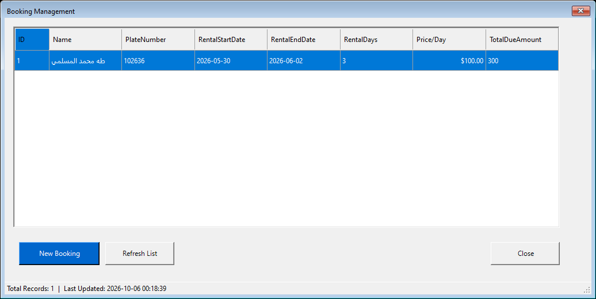

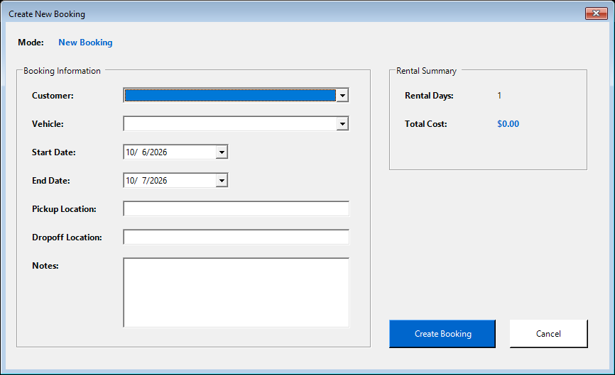

### Returns

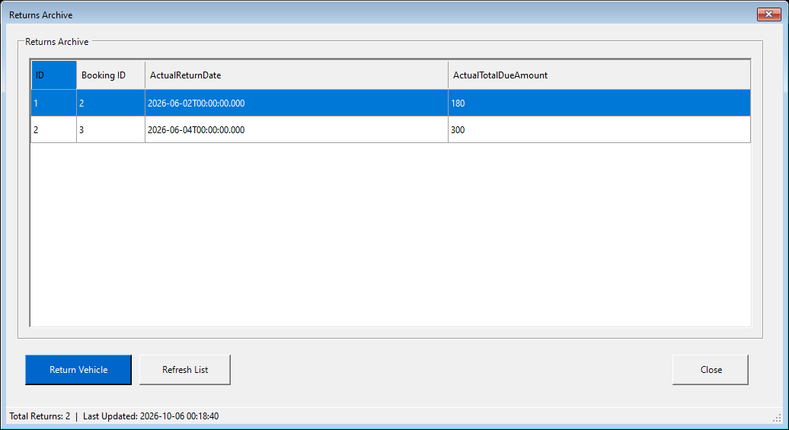

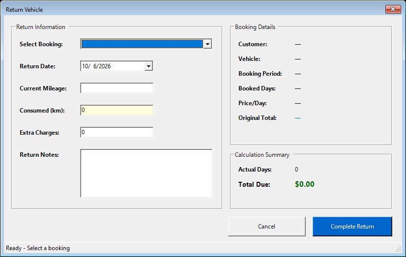

### Transactions

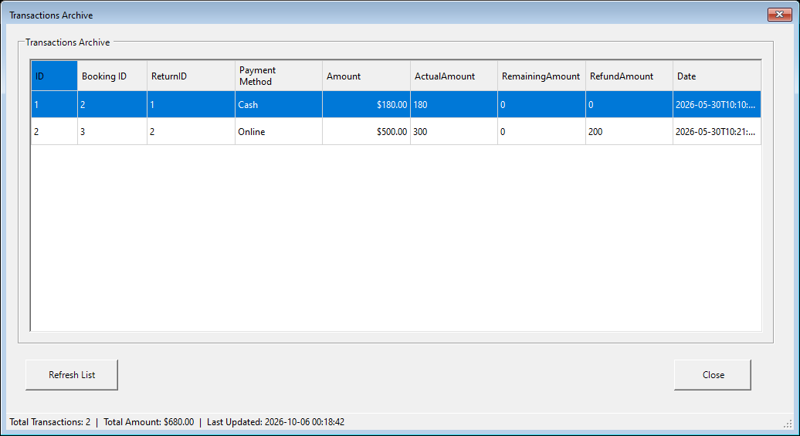

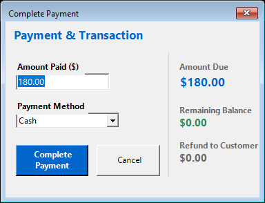

### Maintenance

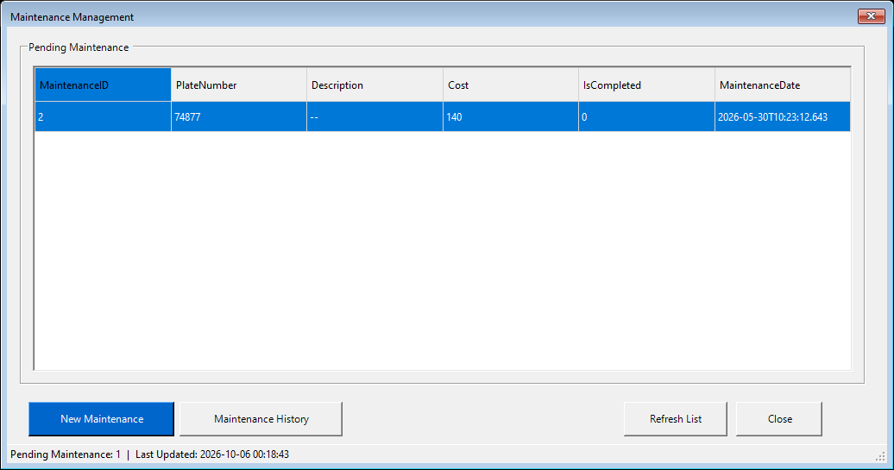

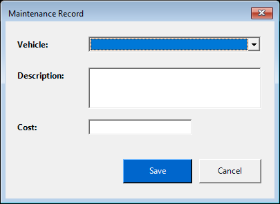

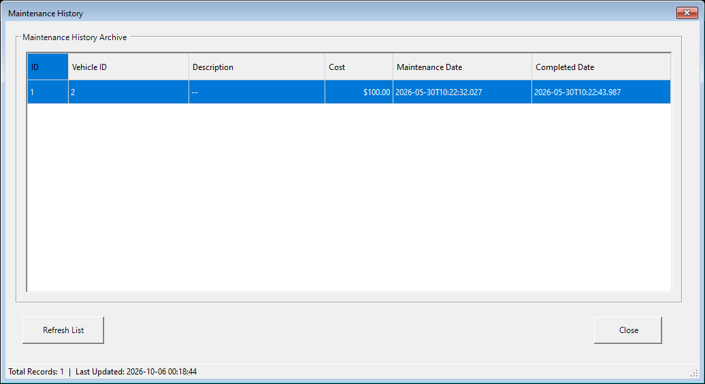

## Getting Started

### Prerequisites

- Windows 10/11
- Visual Studio 2022 (with .NET Desktop Development workload), or .NET SDK 8 for command-line builds
- No database server needed - SQLite is embedded and the database file is included

### Clone and run

```bash
git clone https://github.com/XREFS0/XREFS0-Car-Rental.git
cd XREFS0-Car-Rental
dotnet build XREFS0-Car-Rental.sln
```

Then run `XREFS0CarRental/bin/Debug/XREFS0CarRental.exe` (the database file is copied next to the executable automatically on build).

### Default credentials

- Username: `admin`
- Password: `1234`

## Project Structure

```text
XREFS0-Car-Rental/
  XREFS0-Car-Rental.sln
  XREFS0CarRental/        WinForms UI (forms, custom painting, resources)
  XREFS0Business/         Business-logic class library
  XREFS0Data/             SQLite data-access class library
  Database/               XREFS0CarRental.db + schema and seed scripts
  libs/                   Local SQLite runtime (managed + x86/x64 interop)
  screenshots/            Application screenshots used in this README
```

## Configuration

The connection string lives in `XREFS0Data/clsDataAccessSettings.cs` and points to `XREFS0CarRental.db` next to the executable. To start from a clean database, delete the copy beside the executable and rebuild - or regenerate it from the scripts in `Database/`.

## Security Notes

- Every database query is parameterized; the application is not vulnerable to SQL injection through its inputs
- Authentication is role-based with a failed-attempt lockout on the login form
- The SQLite file holds operational data in plain form - restrict file access on shared machines

## Notes

This project was migrated from a SQL Server-based setup to a fully self-contained SQLite application, rebranded and rebuilt as XREFS0 Car Rental v1.0. It is intended for learning, portfolio, and small-business use.
